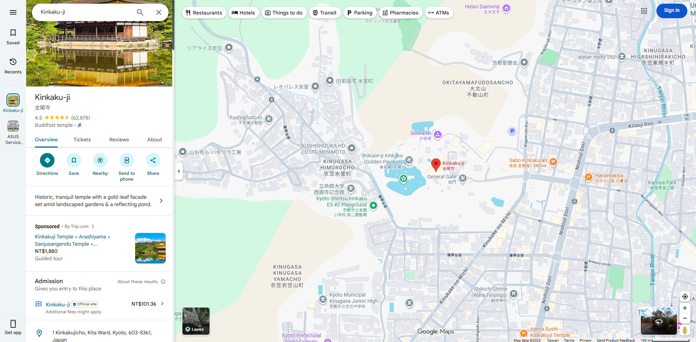
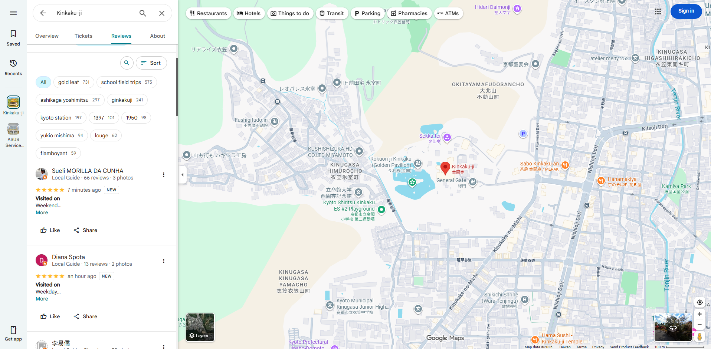
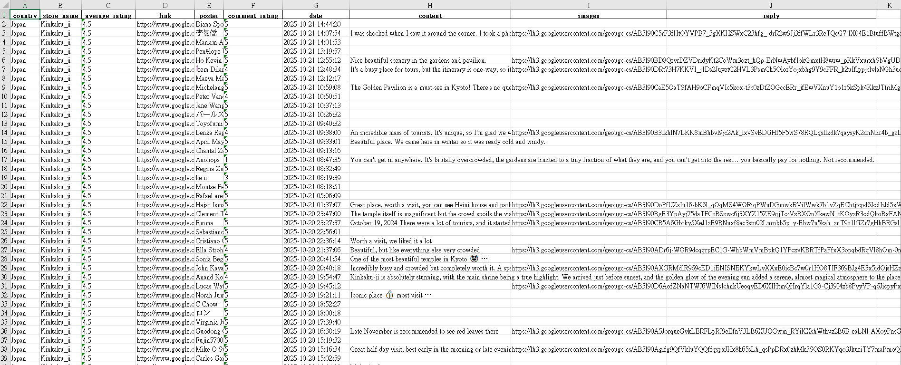

# | **Google Maps Review Crawler** 

An automated Google Maps review crawler developed with Python 3.13 + Playwright. 
It automatically extracts business information, the latest reviews, ratings, images, and owner replies, 
then exports the collected data into an Excel file for easy analysis and organization. 

## | **Features** 

1. Automatically opens each business page on Google Maps 
2. Extracts address, country, and average rating 
3. Collects reviews sorted by **“Newest”**, including: 
   · Reviewer name 
   · Rating (numeric only) 
   · Review content 
   · Business reply (if available) 
   · Review image URLs 
   · Review date 
4. Automatically exports results to an **Excel (.xlsx)** file 

*Automatically stops at reviews older than one year to avoid duplicates and unnecessary data.* 
 
 
## | **Package Installation** 

`pip install -r requirements.txt` 

## | **Target Business Configuration** 

Please paste the Google Maps link of the business you want to scrape reviews from into **store_url**. 

## | **Output File** 
 
  
# | **Google Maps 評論爬蟲** 

以 Python 3.13 + Playwright 開發的自動化 Google Maps 評論爬蟲工具。 
可自動擷取店家資訊、最新評論、星等、圖片、商家回覆等資料， 
並將結果輸出為 Excel 檔案，方便後續分析與整理。 

## | **功能特色** 

1. 自動開啟 Google Maps 各店家頁面 
2. 擷取地址、國家、平均評分 
3. 收集「最新排序」評論，包含： 
  · 評論者名稱 
  · 星等（純數字） 
  · 評論內容 
  · 店家回覆（若有） 
  · 評論圖片連結 
  · 評論時間 
4. 結果自動輸出至 Excel (.xlsx) 

*自動停止在一年以前的評論，避免重複與冗長資料* 
 
 
## | **套件安裝** 

`pip install -r requirements.txt` 

## | **目標商家設定** 

請至 strore_url 貼上想要爬取評論的商家 Google Map 連結

## | **輸出檔案** 

 
